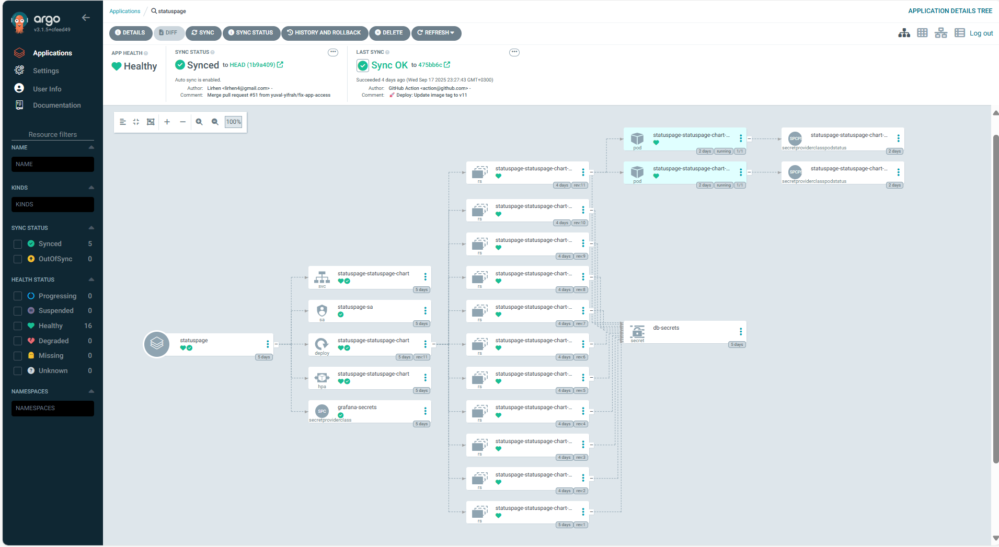
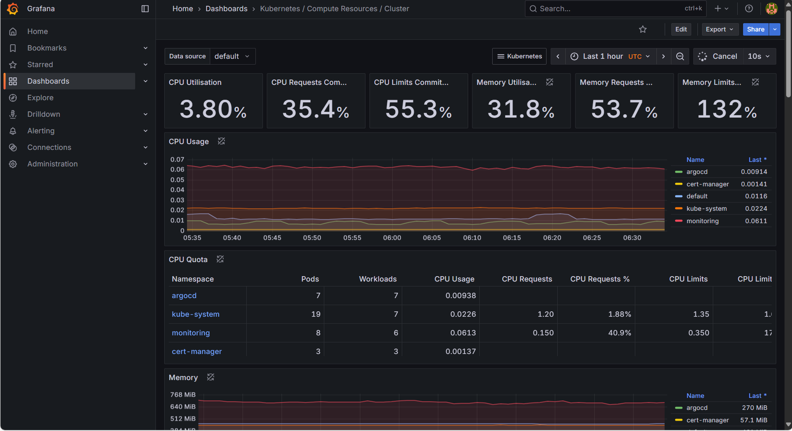
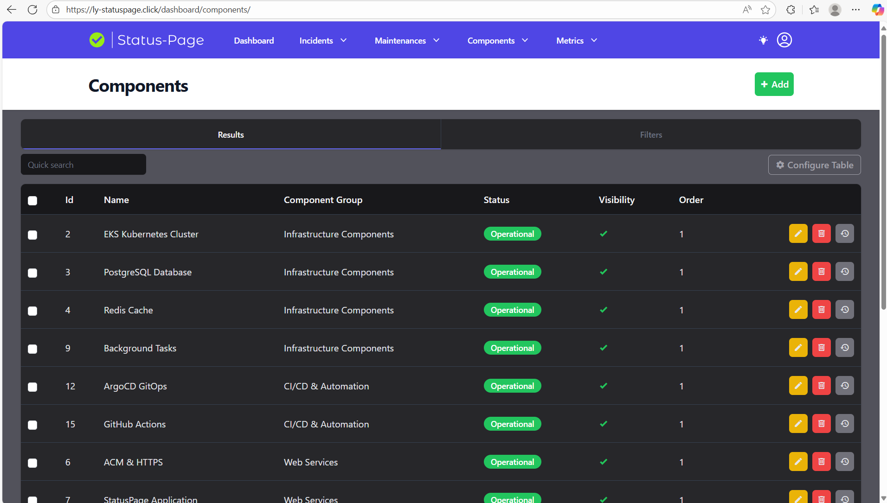
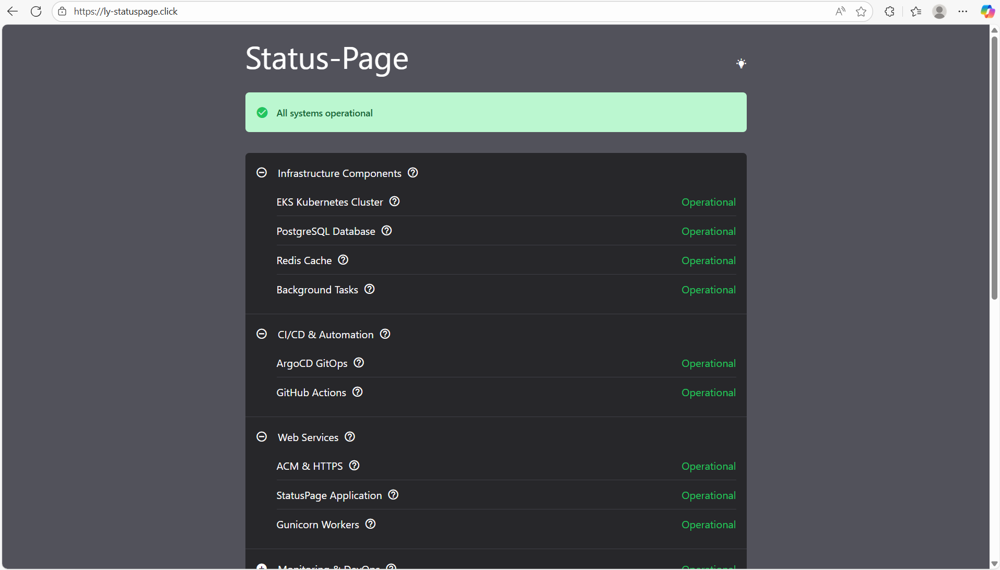

# Lir Chen | DevOps & Software Development Professional

---

## 📊 GitHub Analytics

---

## 📈 Activity Graph

---

## 👨‍💻 About Me

Computer Science graduate with hands-on **DevOps** training and practical **full-stack development** experience.  
Former IDF officer with **6 years of leadership** in planning and resource management.  
I build **secure, scalable, and efficient systems** by combining software engineering with modern DevOps practices.

**🎯 Currently seeking:** DevOps Engineer or Software Developer role  
**🌱 Learning:** Advanced Kubernetes, Terraform, and Cloud Architecture

---

## 🛠️ Tech Stack

**Frontend**  
React · React Native · JavaScript · HTML5 · CSS3

**Backend**  
Node.js · Express.js · Python · Java · RESTful APIs

**Databases**  
MySQL · MongoDB · Firebase

**DevOps & Cloud**  
AWS (EC2, ECS, ECR, Lambda, S3, RDS, VPC, IAM, CloudWatch)  
Docker · Kubernetes · Terraform · Jenkins · GitHub Actions · ArgoCD  
Prometheus · Grafana · Ansible

**Systems & Tools**  
Linux (Red Hat, Ubuntu, CentOS) · Windows · Git/GitHub  
Active Directory · DNS · VPN · SAP ERP

---

## 🚀 Featured Projects

### 🔹 DevOps Infrastructure Project
📽️ **[LinkedIn Demo](https://lnkd.in/p/gEsx_zqx)** - Enterprise-grade cloud infrastructure with comprehensive monitoring

.drawio%20(1).png)
*Complete AWS infrastructure with EKS, RDS, and ElastiCache Redis*

*GitOps deployment with ArgoCD automated sync and rollback*

*Real-time cluster monitoring with Grafana dashboards*

*Public status page monitoring all infrastructure components*

*Live infrastructure status monitoring interface*

- **Production-Ready AWS Infrastructure** with EKS cluster, PostgreSQL RDS, ElastiCache Redis
- **Multi-Worker Node Setup** with proper resource allocation and auto-scaling
- **GitOps Deployment** using ArgoCD with automated sync and rollback capabilities
- **Comprehensive Monitoring** - Grafana dashboards showing real-time cluster metrics
- **Status Page Integration** - Public status monitoring for all infrastructure components
- **Security & Networking** - VPC with public/private subnets, NAT Gateway, and Load Balancers

**Tech Stack:** `AWS EKS` `Terraform` `ArgoCD` `Prometheus/Grafana` `PostgreSQL` `Redis` `Helm`

---

### 🔹 Cost Manager - RESTful Web Services
📽️ **[YouTube Demo](https://www.youtube.com/watch?v=QDyM50J_zkc)** | 🌐 **[Live API](https://final-project-server-side-h0n0.onrender.com)** - Complete expense management system with professional backend architecture
- **RESTful API** with comprehensive CRUD operations and automated testing
- **MongoDB Atlas** integration with Mongoose ODM and optimized schemas
- **Computed Pattern** implementation for cached monthly reports
- **Professional Logging** with Pino and comprehensive test coverage with Jest
- **Production Deployment** on Render with health monitoring

**Tech Stack:** `Node.js` `Express.js` `MongoDB Atlas` `Jest` `Pino` `Supertest`

---

### 🔹 FlavorWorld - React Native Recipe Social Network
**🎬 [Live Demo on LinkedIn](https://lnkd.in/p/gd4WFsUQ)** - Modern social network for sharing recipes and building culinary communities
- **React Native Mobile App** with complete social networking capabilities
- **Microservices Backend** with API Gateway and specialized services (Auth, User, Recipe, Group, Chat)
- **Real-time Communication** using Socket.IO for private messaging and group chats
- **Advanced Social Features** - Follow system, groups, likes, comments, and push notifications
- **MongoDB Database** with optimized schema design for social interactions
- **Production-Ready Architecture** with file upload handling, JWT authentication, and email services

**Tech Stack:** `React Native` `Node.js` `Express` `Socket.IO` `MongoDB` `JWT` `Expo`

---

### 🔹 Full-Stack Authentication App with Event Streaming
Enterprise-grade authentication system with real-time data processing and monitoring
- **Microservices Architecture** with React frontend, Node.js API, and Kafka consumer
- **Distributed Database** using TiDB with TiCDC for change data capture
- **Event-Driven Processing** with Kafka for real-time activity logging
- **Containerized Deployment** with Docker Compose for scalable orchestration
- **Advanced Monitoring** with custom logging and database change tracking

**Tech Stack:** `React` `Node.js` `TiDB` `Kafka` `TiCDC` `Docker` `log4js`

---

### 🔹 AWS Resource Manager - CLI & GUI Tool
Comprehensive AWS management tool with both command-line and graphical interfaces
- **Python CLI** using boto3 for AWS resource provisioning (EC2, S3, Route53)
- **GUI Application** for simplified resource management
- **IAM Policy Enforcement** and automated tagging conventions
- **Cost Optimization** features and resource monitoring

**Tech Stack:** `Python` `Boto3` `Tkinter` `AWS API`

---

## 📌 Pinned Repositories

---

## 🎖️ Leadership Experience

**Former IDF Officer** (2018-2025) with progressive leadership roles:
- **Planning Officer** - Cyber Defense & Communications Directorate (Captain)
- **HR Officer** - Personnel management for soldiers and civilians  
- **Team Leadership** - Managed teams up to 4 soldiers with focus on efficiency
- **Strategic Planning** - Resource management using ERP systems (SAP) and data analysis

---

## 🎓 Education & Certifications

**🎓 B.Sc. Computer Science** - Holon Institute of Technology (HIT), Israel (2022-2025)  
**🔧 DevOps Training** - 1000 Hours, Nitzanim To Tech (2025)  
- Red Hat OpenShift Administration I (DO180)
- Red Hat Enterprise Linux Automation with Ansible (RH294)  
- Red Hat System Administration I & II (RH124, RH134)

**🔒 Information Security Course** - DV PLAN, Israel (2024)

---

## 🌍 Languages

**Hebrew** (Native) · **English** (Advanced)

---

## 📫 Let's Connect!

💼 **LinkedIn:** [linkedin.com/in/lir-chen](https://linkedin.com/in/lir-chen)  
💻 **GitHub:** [github.com/LirChen](https://github.com/LirChen)  
📧 **Email:** Lirhen2000@gmail.com  
📍 **Location:** Bat Yam, Israel

---

💡 *"Combining software engineering expertise with DevOps practices to build scalable, secure, and efficient systems."*

⭐ From [LirChen](https://github.com/LirChen)
