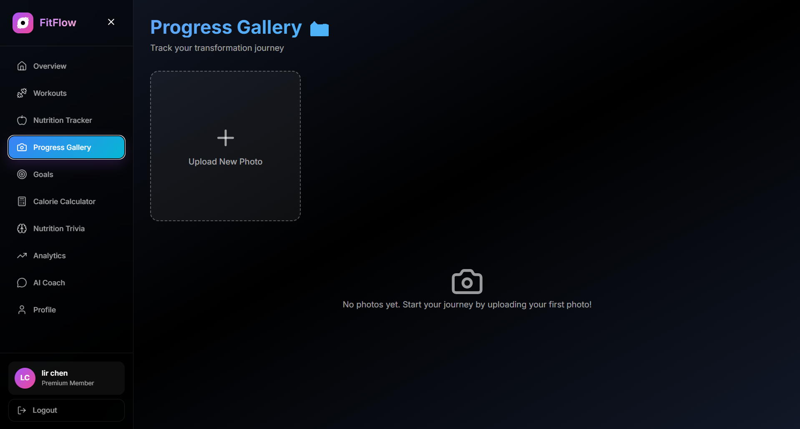

# Hi there, I'm Lir Chen! 👋

---

## 🚀 About Me

**DevOps Engineer and Software Developer** with **6 years of leadership experience** in the **Israeli Defense Forces**, combining cloud infrastructure expertise with hands-on full-stack development. **Computer Science B.Sc. graduate** with extensive experience building production-ready systems.

As a **former IDF officer** with comprehensive **DevOps training** and practical software development experience, I specialize in creating **secure, scalable cloud infrastructures** and building **enterprise-grade applications** using modern technologies including AWS, Kubernetes, Docker, Terraform, and microservices architectures.

- 🎓 **B.Sc. in Computer Science** from Holon Institute of Technology (2022-2025) - **Graduated**
- 🔧 **DevOps Training** - 1000 Hours, Nitzanim To Tech (2025)
- 🎖️ **Former:** Planning Officer at IDF Cyber Defense & Communications Directorate (2023-2025)
- 💻 **Expertise:** AWS, Kubernetes, Docker, Terraform, Linux, React Native, Node.js, Python, DevOps, Microservices

**🎯 Currently seeking:** DevOps Engineer or Software Developer role  
**🌱 Learning:** Advanced Kubernetes, Terraform, and Cloud Architecture  
**🌐 Portfolio:** [lirchen.github.io](https://lirchen.github.io)

---

## 🛠️ Tech Stack & Skills

### **Frontend Development**

### **Backend Development**

### **Databases**

### **DevOps & Cloud**

### **Monitoring & Tools**

### **Real-time & Messaging**

---

## 🏆 Featured Projects

### 🔹 DevOps Infrastructure Project
📽️ **[LinkedIn Demo](https://lnkd.in/p/gEsx_zqx)** - Enterprise-grade cloud infrastructure with comprehensive monitoring

.drawio%20(1).png)
*Complete AWS infrastructure with EKS, RDS, and ElastiCache Redis*

*GitOps deployment with ArgoCD automated sync and rollback*

*Real-time cluster monitoring with Grafana dashboards*

*Public status page monitoring all infrastructure components*

*Live infrastructure status monitoring interface*

**Key Features:**
- **Production-Ready AWS Infrastructure** with EKS cluster, PostgreSQL RDS, ElastiCache Redis
- **Multi-Worker Node Setup** with proper resource allocation and auto-scaling
- **GitOps Deployment** using ArgoCD with automated sync and rollback capabilities
- **Comprehensive Monitoring** - Grafana dashboards showing real-time cluster metrics
- **Status Page Integration** - Public status monitoring for all infrastructure components
- **Security & Networking** - VPC with public/private subnets, NAT Gateway, and Load Balancers

**Tech Stack:** `AWS EKS` `Terraform` `ArgoCD` `Prometheus/Grafana` `PostgreSQL` `Redis` `Helm`

---

### 🔹 FitFlow - Comprehensive Fitness Tracker
🎬 **Demo Video Coming Soon!** - Full-stack fitness tracking platform with AI-powered coach

*Modern fitness dashboard with real-time metrics*

*Interactive analytics with workout frequency and nutrition insights*

*Comprehensive workout logging with duration and difficulty tracking*

*Daily meal tracking with complete macronutrient breakdown*

*24/7 AI-powered fitness coach for personalized advice*

*Visual progress tracking with transformation photos*

**Key Features:**
- **Dashboard Overview** - Real-time fitness summary with weekly workouts, daily calories, BMI, and active streak
- **Workout Tracking** - Log exercises with duration, difficulty, and comprehensive history
- **Nutrition Tracker** - Track meals by type with complete macros breakdown (protein, carbs, fats)
- **Progress Gallery** - Upload and visualize transformation photos over time
- **Goals Management** - Set measurable fitness milestones with visual progress bars
- **Analytics & Stats** - 4 interactive charts (workout frequency, calorie intake, macros, duration trends)
- **BMR/TDEE Calculator** - Calculate daily calorie needs based on personal metrics
- **Nutrition Trivia** - Interactive quiz game to test nutrition knowledge
- **AI Fitness Coach** - Personalized advice powered by Mistral AI
- **Comprehensive Testing** - 100+ tests with Jest covering all API endpoints

**Tech Stack:** `React 18` `Node.js` `Express` `MongoDB` `Docker` `Mistral AI` `Recharts` `Jest` `Nginx`

---

### 🔹 FlavorWorld - React Native Recipe Social Network
🎬 **[Live Demo on LinkedIn](https://lnkd.in/p/gd4WFsUQ)** - Modern social network for sharing recipes and building culinary communities

**Key Features:**
- **React Native Mobile App** with complete social networking capabilities
- **Microservices Backend** with API Gateway and specialized services (Auth, User, Recipe, Group, Chat)
- **Real-time Communication** using Socket.IO for private messaging and group chats
- **Advanced Social Features** - Follow system, groups, likes, comments, and push notifications
- **MongoDB Database** with optimized schema design for social interactions
- **Production-Ready Architecture** with file upload handling, JWT authentication, and email services

**Tech Stack:** `React Native` `Node.js` `Express` `Socket.IO` `MongoDB` `JWT` `Expo`

---

### 🔹 Cost Manager - RESTful Web Services
📽️ **[YouTube Demo](https://www.youtube.com/watch?v=QDyM50J_zkc)** | 🌐 **[Live API](https://final-project-server-side-h0n0.onrender.com)** - Complete expense management system with professional backend architecture

**Key Features:**
- **RESTful API** with comprehensive CRUD operations and automated testing
- **MongoDB Atlas** integration with Mongoose ODM and optimized schemas
- **Computed Pattern** implementation for cached monthly reports
- **Professional Logging** with Pino and comprehensive test coverage with Jest
- **Production Deployment** on Render with health monitoring

**Tech Stack:** `Node.js` `Express.js` `MongoDB Atlas` `Jest` `Pino` `Supertest`

---

### 🔹 Full-Stack Authentication App with Event Streaming
Enterprise-grade authentication system with real-time data processing and monitoring

*User management dashboard with real-time profile information and system analytics*

*Clean, modern login interface with secure authentication flow*

**Key Features:**
- **Microservices Architecture** with React frontend, Node.js API, and Kafka consumer
- **Distributed Database** using TiDB with TiCDC for change data capture
- **Event-Driven Processing** with Kafka for real-time activity logging
- **Containerized Deployment** with Docker Compose for scalable orchestration
- **Advanced Monitoring** with custom logging and database change tracking

**Tech Stack:** `React` `Node.js` `TiDB` `Kafka` `TiCDC` `Docker` `log4js`

---

### 🔹 AWS Resource Manager - CLI & GUI Tool
Comprehensive AWS management tool with both command-line and graphical interfaces

*Professional GUI interface for AWS resource management with EC2, S3, and Route53 support*

**Key Features:**
- **Python CLI** using boto3 for AWS resource provisioning (EC2, S3, Route53)
- **GUI Application** for simplified resource management
- **IAM Policy Enforcement** and automated tagging conventions
- **Cost Optimization** features and resource monitoring

**Tech Stack:** `Python` `Boto3` `Tkinter` `AWS API`

---

## 📊 GitHub Analytics

---

## 📌 Pinned Repositories

---

## 🏅 Leadership Experience & Certifications

### **🎖️ Military Service**
- **2023–2025:** Planning Officer (Captain) - Cyber Defense & Communications Directorate, IDF
- **2021–2023:** HR Officer - Personnel management for soldiers and civilians, IDF  
- **2020–2021:** HR Officer - Reserve Units, IDF
- **2018–2020:** Non-Commissioned Officer - Service Suitability Committee, IDF

### **🎓 Education & Certifications**
- **B.Sc. Computer Science** - Holon Institute of Technology (HIT), Israel (2022-2025)  
- **DevOps Training** - 1000 Hours, Nitzanim To Tech (2025)
  - Red Hat OpenShift Administration I (DO180)
  - Red Hat Enterprise Linux Automation with Ansible (RH294)  
  - Red Hat System Administration I & II (RH124, RH134)
- **Information Security Course** - DV PLAN, Israel (2024)

---

## 📈 Current Focus

🔧 **DevOps Innovation:** Developing cutting-edge DevOps projects using emerging cloud technologies and automation tools to build robust, scalable infrastructures

🌐 **Full-Stack Web Development:** Creating modern web applications with comprehensive frontend and backend solutions

🚀 **Integrated Architecture:** Combining DevOps practices with full-stack development to build complete infrastructure foundations for the applications I develop - from cloud deployment to user interface

🔒 **Cloud-Native Solutions:** Implementing enterprise-grade security and scalability measures in cloud environments while maintaining development agility

---

## 🌍 Languages

**Hebrew** (Native) · **English** (Advanced)

---

## 📬 Let's Connect!

---

💡 *"Combining software engineering expertise with DevOps practices to build scalable, secure, and efficient systems."*

⭐ From [LirChen](https://github.com/LirChen)
